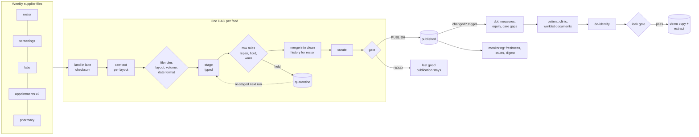

# population-health-pipeline

[](https://github.com/data-dl/population-health-pipeline/actions/workflows/tests.yml)

A data pipeline for a community health network. Five suppliers deliver files every week: the patient
roster, behavioral-health and social-needs screenings, laboratory results, appointments from two
scheduling systems, and pharmacy claims. Out come a validated, audited warehouse, nine quality measures
with equity reporting, longitudinal patient documents for a care-management application, and a
de-identified copy that is safe to hand to engineers and trainers.

Python and SQL on DuckDB, dbt for the measures, R for an independent second implementation of the
screening rules, and task graphs that run locally or on Apache Airflow.

**Status:** the whole system runs end to end on a generated network of 5,000 synthetic patients across
five scheduled runs, and is graded against an answer key in CI on Linux and Windows. All 269 planted
data defects are caught by the rule each was planted for, and nothing else is touched. All nine measures
match an independent Python implementation at every clinic, and adherence matches patient by patient.
The de-identified copy passes a 12-check leak gate before it is released.

## Reviewing this repo

- **Five minutes:** this page, then [docs/sample_run/](docs/sample_run/). Start with the
  [third run's summary](docs/sample_run/2026-03-02_01/summary.md): it stops a truncated file, recognises
  a supplier's new layout, and warns that a delivery is due.
- **Fifteen minutes:** run it with the commands under *How to run*. It needs Python 3.11+; the
  dependencies are DuckDB, PyYAML and dbt.
- **Thirty minutes:** read in this order:
  - [config/contracts/labs.yaml](config/contracts/labs.yaml): a data contract, two supplier layouts and 13 rules
  - [pophealth/ingest.py](pophealth/ingest.py): the path every delivery takes
  - [dbt/models/intermediate/int_pdc.sql](dbt/models/intermediate/int_pdc.sql): medication adherence without recursion
  - [tests/test_pipeline.py](tests/test_pipeline.py): the grading
- **The why behind every choice:** [docs/design_decisions.md](docs/design_decisions.md). Plain-language
  tour and glossary: [docs/guidebook.md](docs/guidebook.md). Operating it:
  [docs/runbook.md](docs/runbook.md).

## The problem

Supplier files are wrong in the ways real feeds are wrong:

- record numbers lose their leading zeros in a spreadsheet
- a laboratory changes its file layout and starts reporting in different units
- a scheduling extract is cut off halfway
- a screening platform's totals disagree with its own item answers
- results arrive for patients the roster has not registered yet
- claims for a year that has already been reported keep arriving
- one week, a file doesn't come at all

A data team has to get this data in safely, notice and say when something is wrong, produce numbers
people act on (who is overdue for an HbA1c test, who stopped taking their statin), and share data
without exposing patients. This repository does each of those with engineering controls rather than
by hand. Every such control is written down and tested.

## What the pipeline guarantees

- **Nothing about a supplier is guessed.** Each feed has a [data contract](config/contracts/): steward,
  schedule, every file layout, every column's classification, and its rules. A file whose header
  matches no registered layout is stopped. The pipeline explains the difference and never loads the
  file by position.
- **Every row is accounted for.** For every file in every run:
  - raw = staged + malformed
  - staged = passed + held
  - passed = inserted + updated + unchanged + de-duplicated

  If a count doesn't reconcile, the feed does not publish.
- **Rows are held, not dropped.** A failing row goes to quarantine with the rule it failed. If the
  failure can resolve itself (the patient gets registered, a code mapping is added), the row is
  re-staged from its raw text on the next run and released. Otherwise it waits for a data steward.
- **Fix what is provable, guess nothing else.** Lost leading zeros and lower-case clinic codes are
  repaired and recorded. A unit the contract doesn't list is never converted. A blank screening answer
  never becomes a zero.
- **A few bad rows are held; too many stop the file.** Each rule declares its action. The screening
  item rule escalates from holding rows to stopping the whole file when more than 5% of the rows fail.
- **Nothing publishes past a gap.** Consumers read only published tables. A feed publishes all or
  nothing, and not at all while one of its files is stopped. That lasts until the file is re-delivered,
  or a steward decides: accept it (it loads, the rule overridden) or waive it (the feed publishes
  without it). Either decision is recorded with its reason.
- **Late data is announced.** Rows for a year that has already been reported restate its measures. The
  run says so, and shows the change.
- **Identifiers do not leave.** The demo copy and the analytic extract pass a leak gate. It searches all
  their text for every real record number, name, phone number, e-mail and street address before anything
  is released. Run summaries mask identifiers.
- **Idempotent.** Re-running a day changes nothing, any single task can be re-run on its own, and a run
  that stops part-way is finished by the next one.
- **Every run leaves evidence:** a readable summary, a manifest, and a CSV behind every number in it.

## How it flows



| DAG | tasks | what it does |
|---|---|---|
| `feed_<name>` (x5) | 22 | sensor, land, branch, load, file rules, stage, re-check held rows, row rules, merge, curate, gate, publish or hold, trigger |
| `measures_and_documents` | 9 | `dbt build` (models and tests), documents built in parallel by clinic, de-identify, leak gate, release or hold |
| `monitoring` | 6 | freshness report, run health, issue register, digest and evidence |

`python -m pophealth dags` prints them. The same definitions run on Airflow; see [airflow/](airflow/).

## The scenario

`python -m pophealth demo` generates the supplier files and runs five scheduled days:

| run | as of | what happens |
|---|---|---|
| 1 | 2026-02-16 | A year of history from all five suppliers. Rows for 12 newly registered patients arrive before the roster knows them, and are held. |
| 2 | 2026-02-23 | The roster catches up and the held rows are released. Appointment statuses change. Late 2025 lab results and claims restate the closed year's adherence and HbA1c measures. |
| 3 | 2026-03-02 | The laboratory's new layout is recognised (IFCC units converted) and clean data is archived first. The clinic appointments file arrives a third of its usual size and is stopped. The feed holds its publication. The pharmacy file is due today. |
| 4 | 2026-03-03 | The appointments file is re-delivered, loaded and published, and the issue closes itself. The pharmacy file is now late, and an issue opens. |
| 5 | 2026-03-03 | The same day again: nothing new, nothing changes. |

The committed evidence of all five runs is in [docs/sample_run/](docs/sample_run/).

## How to run

```bash
python -m venv .venv
source .venv/bin/activate                  # Windows: .venv\Scripts\activate
pip install -e ".[dev]"
python -m pophealth demo --out build/demo  # generate the inbox and run all five days (about two minutes)
python -m pytest                           # the graded scenario, unit tests, Airflow adapter, R parity
```

Then, against that workspace:

```bash
python -m pophealth --workspace build/demo --inbox build/demo/demo/inbox issues
python -m pophealth --workspace build/demo --inbox build/demo/demo/inbox freshness --as-of 2026-03-03
python -m pophealth --workspace build/demo --inbox build/demo/demo/inbox task feed_labs validate_rows --as-of 2026-03-03
```

`task` runs one step on its own (the troubleshooting path). The R check needs R with `data.table`
and `yaml`: `Rscript r/score_screenings.R <file> <extract date> <out dir>`. Without R, its parity test
is skipped.

## Data

Everything here is synthetic. `synth/` builds a fictional network (12 clinics, a mobile unit, 5,000
patients) from a fixed seed, renders a year of supplier files, and plants 269 defects of 26 kinds.
Every defect is recorded in [demo/answer_key.json](demo/answer_key.json) with its file, row, the rule
that must catch it, and where it must end up. The answer key also holds each measure's expected result
at every clinic. Those results come from a second, independent Python implementation
([synth/oracle.py](synth/oracle.py)), and the dbt models are graded against it.

Names come from common-name lists, phone numbers use the fictional 555 exchange, and e-mail addresses
use the reserved example.org domain. PHQ-9, GAD-7, LOINC and ICD-10-CM codes are public standards;
see [ASSUMPTIONS.md](ASSUMPTIONS.md) for every invented default.

## What this demonstrates

- **Data engineering:** multi-supplier ingestion with an immutable lake, layout detection and schema
  change handling, and incremental merges by natural key with row hashes. The roster keeps type 2
  history. Tasks are idempotent and communicate through durable state. DAGs run on Airflow semantics
  (sensors, branches, trigger rules, retries), with parallel document builds and DuckDB SQL throughout
  (UNPIVOT, window functions, MERGE-style upserts).
- **Data management:** data contracts with stewardship, SLAs and column classification. There is a rule
  registry with severities and escalation, quarantine with retry, reconciliation of every file, a data
  dictionary, rule catalogue and lineage generated from configuration, change records for supplier
  layout changes, and an issue register that opens, ages and resolves issues on its own.
- **Analytics engineering:** a dbt project covering HbA1c testing and control, depression screening and
  30-day follow-up, social-needs screening, and PQA-style proportion of days covered. It includes equity
  stratification with relative rates and small-cell plus complementary suppression, rolling
  kept-appointment windows, and care-gap worklists. Every number is traceable to the patients behind it.
- **Privacy engineering:** field-level de-identification policies, pseudonyms from a restricted
  crosswalk, a per-patient date shift that preserves intervals, and a Safe Harbor-style extract. A leak
  gate searches the full text for real identifiers, and quasi-identifier group sizes are reported.
- **Quality engineering:** a generator with an answer key, a second implementation for every measure,
  a second language for the screening rules (R, data.table), and 84 tests in CI.

## Layout

```
config/
  pipeline.yaml          paths, measurement year, alert channels, thresholds
  contracts/             one data contract per feed: layouts, columns, rules
  reference/             clinics, instruments, lab codes and units, code maps, drug classes, conditions
  deid/                  de-identification policies (demo_site, safe_harbor)
  collections.yaml       document collections and their lineage
pophealth/
  ingest.py              the feed operations, in order;  rules.py  the rule engine
  feeds/                 per-feed typing and curation (the only feed-specific code)
  orchestration/         DAG definitions, the runner, the Airflow adapter
  tasks/                 the callables the DAGs run
  documents/             document builders and the document store
  deid/                  de-identification engine and the leak gate
  monitoring.py          freshness, run health, issue register;  evidence.py  run summaries
  cli.py                 python -m pophealth
dbt/                     staging, intermediate and mart models, tests, measure definitions
r/                       the screening rules and scoring in R (data.table)
airflow/                 the Airflow DAG file and how to deploy it
synth/                   the synthetic network, supplier files, planted defects, measure oracle
demo/                    committed samples of each file layout and the answer key
docs/                    design decisions, guidebook, runbook, de-identification, generated
                         dictionary / rules / lineage, change records, sample run
tests/                   the graded scenario, unit tests, R parity, Airflow parsing, privacy
```

## Tests

The session runs the whole five-day scenario once, and the end-to-end tests read what it left behind:

- every planted defect is caught by its rule, with nothing extra held, repaired or warned
- held rows end where the story says (released, superseded or still held)
- merge counts match, and every file's rows reconcile
- the stopped file holds the feed until its re-delivery
- measures run only when published data changed
- the same-day re-run changes nothing
- the layout change is archived
- HbA1c units convert exactly
- roster history is type 2
- freshness and the issue register tell the story

The measure tests compare dbt's results with the answer key at every clinic, and adherence patient by
patient. The de-identification tests require the leak gate to have passed, and show it would catch a
planted leak, a policy that misses an identifier, or an unclassified column. Unit tests run single
feeds on hand-written files: each rule in isolation, a steward accepting or waiving a stopped file, a
code mapping releasing held rows, and a run that stops part-way being finished by the next.
The R parity test runs the screening rules in R and in the pipeline on the same file and requires
identical results. The Airflow adapter's entry points drive feed DAGs the way Airflow calls them, and CI
parses the DAG file under Airflow 3.3 and 2.11. A privacy test keeps paths, addresses and credentials out
of the repository.

## License

MIT. This material contains content from LOINC (http://loinc.org). LOINC is copyright Regenstrief
Institute, Inc. and the Logical Observation Identifiers Names and Codes (LOINC) Committee and is
available at no cost under the license at http://loinc.org/license.
