<!-- Generated by `pophealth docs` from config/ and dbt/; do not edit by hand. -->

# Lineage

From supplier file to the de-identified copy. Generated from the contracts, the dbt models' `ref()`/`source()` calls, and `config/collections.yaml`.

```mermaid
flowchart LR
    subgraph Supplier_files["Supplier files"]
        file_ehr_roster["ehr_roster files"]
        file_screening_platform["screening_platform files"]
        file_reference_lab["reference_lab files"]
        file_clinic_scheduling["clinic_scheduling files"]
        file_mobile_unit["mobile_unit files"]
        file_pharmacy_claims["pharmacy_claims files"]
    end
    subgraph raw__text__per_layout_["raw (text, per layout)"]
        raw_roster__ehr_roster__v1["raw.roster__ehr_roster__v1"]
        raw_screenings__screening_platform__v1["raw.screenings__screening_platform__v1"]
        raw_labs__reference_lab__v1["raw.labs__reference_lab__v1"]
        raw_labs__reference_lab__v2["raw.labs__reference_lab__v2"]
        raw_appointments__clinic_scheduling__v1["raw.appointments__clinic_scheduling__v1"]
        raw_appointments__mobile_unit__v1["raw.appointments__mobile_unit__v1"]
        raw_pharmacy__pharmacy_claims__v1["raw.pharmacy__pharmacy_claims__v1"]
    end
    subgraph staging____clean["staging -> clean"]
        staging_roster["staging.roster"]
        clean_patients_history["clean.patients_history"]
        quarantine_roster["quarantine.roster"]
        staging_screenings["staging.screenings"]
        clean_screenings["clean.screenings"]
        quarantine_screenings["quarantine.screenings"]
        staging_labs["staging.labs"]
        clean_labs["clean.labs"]
        quarantine_labs["quarantine.labs"]
        staging_appointments["staging.appointments"]
        clean_appointments["clean.appointments"]
        quarantine_appointments["quarantine.appointments"]
        staging_pharmacy["staging.pharmacy"]
        clean_pharmacy["clean.pharmacy"]
        quarantine_pharmacy["quarantine.pharmacy"]
    end
    subgraph published["published"]
        published_patients["published.patients"]
        published_patient_conditions["published.patient_conditions"]
        published_patient_attribution_history["published.patient_attribution_history"]
        published_screening_events["published.screening_events"]
        published_screening_items["published.screening_items"]
        published_lab_results["published.lab_results"]
        published_appointments["published.appointments"]
        published_pharmacy_fills["published.pharmacy_fills"]
        published_pharmacy_claims["published.pharmacy_claims"]
    end
    subgraph dbt["dbt"]
        int_patient_facts["int_patient_facts"]
        int_pdc["int_pdc"]
        appointment_period_comparison["appointment_period_comparison"]
        appointment_windows["appointment_windows"]
        care_gaps["care_gaps"]
        measure_equity["measure_equity"]
        measure_patient_results["measure_patient_results"]
        measure_summary["measure_summary"]
        stg_appointments["stg_appointments"]
        stg_lab_results["stg_lab_results"]
        stg_patient_conditions["stg_patient_conditions"]
        stg_patients["stg_patients"]
        stg_pharmacy_fills["stg_pharmacy_fills"]
        stg_screening_events["stg_screening_events"]
        measure_definitions["measure_definitions (seed)"]
    end
    subgraph documents["documents"]
        documents_patients["patients documents"]
        documents_clinics["clinics documents"]
        documents_worklists["worklists documents"]
    end
    subgraph de_identified["de-identified"]
        demo_copy["demo-site copy (demo_site policy)"]
        safe_harbor["Safe Harbor extract"]
    end
    file_ehr_roster --> raw_roster__ehr_roster__v1
    raw_roster__ehr_roster__v1 --> staging_roster
    staging_roster --> clean_patients_history
    staging_roster --> quarantine_roster
    clean_patients_history --> published_patients
    clean_patients_history --> published_patient_conditions
    clean_patients_history --> published_patient_attribution_history
    file_screening_platform --> raw_screenings__screening_platform__v1
    raw_screenings__screening_platform__v1 --> staging_screenings
    staging_screenings --> clean_screenings
    staging_screenings --> quarantine_screenings
    clean_screenings --> published_screening_events
    clean_screenings --> published_screening_items
    file_reference_lab --> raw_labs__reference_lab__v1
    raw_labs__reference_lab__v1 --> staging_labs
    file_reference_lab --> raw_labs__reference_lab__v2
    raw_labs__reference_lab__v2 --> staging_labs
    staging_labs --> clean_labs
    staging_labs --> quarantine_labs
    clean_labs --> published_lab_results
    file_clinic_scheduling --> raw_appointments__clinic_scheduling__v1
    raw_appointments__clinic_scheduling__v1 --> staging_appointments
    file_mobile_unit --> raw_appointments__mobile_unit__v1
    raw_appointments__mobile_unit__v1 --> staging_appointments
    staging_appointments --> clean_appointments
    staging_appointments --> quarantine_appointments
    clean_appointments --> published_appointments
    file_pharmacy_claims --> raw_pharmacy__pharmacy_claims__v1
    raw_pharmacy__pharmacy_claims__v1 --> staging_pharmacy
    staging_pharmacy --> clean_pharmacy
    staging_pharmacy --> quarantine_pharmacy
    clean_pharmacy --> published_pharmacy_fills
    clean_pharmacy --> published_pharmacy_claims
    stg_appointments --> int_patient_facts
    stg_patient_conditions --> int_patient_facts
    stg_patients --> int_patient_facts
    stg_pharmacy_fills --> int_pdc
    stg_appointments --> appointment_period_comparison
    stg_appointments --> appointment_windows
    stg_patients --> appointment_windows
    measure_patient_results --> care_gaps
    appointment_windows --> care_gaps
    stg_screening_events --> care_gaps
    stg_patients --> care_gaps
    measure_patient_results --> measure_equity
    int_patient_facts --> measure_equity
    int_patient_facts --> measure_patient_results
    stg_screening_events --> measure_patient_results
    stg_appointments --> measure_patient_results
    stg_lab_results --> measure_patient_results
    int_pdc --> measure_patient_results
    measure_patient_results --> measure_summary
    measure_definitions --> measure_summary
    published_appointments --> stg_appointments
    published_lab_results --> stg_lab_results
    published_patient_conditions --> stg_patient_conditions
    published_patients --> stg_patients
    published_pharmacy_fills --> stg_pharmacy_fills
    published_screening_events --> stg_screening_events
    published_patients --> documents_patients
    published_patient_conditions --> documents_patients
    published_screening_events --> documents_patients
    published_lab_results --> documents_patients
    int_pdc --> documents_patients
    appointment_windows --> documents_patients
    care_gaps --> documents_patients
    documents_patients --> demo_copy
    int_patient_facts --> documents_clinics
    measure_summary --> documents_clinics
    care_gaps --> documents_clinics
    published_patients --> documents_clinics
    documents_clinics --> demo_copy
    care_gaps --> documents_worklists
    documents_worklists --> demo_copy
    published_patients --> safe_harbor
    int_patient_facts --> safe_harbor
    measure_patient_results --> safe_harbor
```

